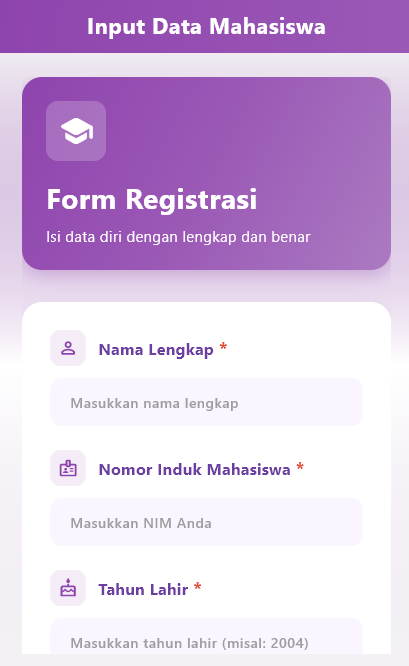
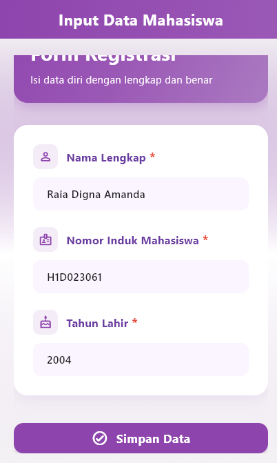
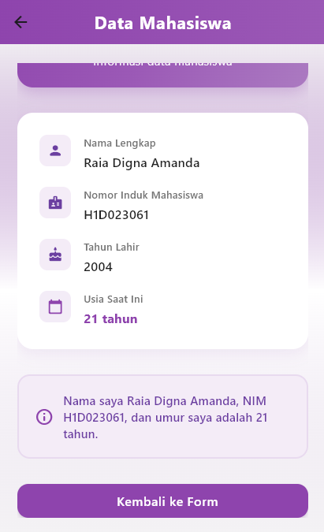

# Tugas 6 Pertemuan 8

## 🧩 Nama Proyek
`H1D023061_Tugas6`

## 👨‍💻 Identitas
**Nama:** Raia Digna Amanda
**NIM:** H1D023061

---

## 📖 Deskripsi
Aplikasi ini menampilkan proses pengiriman data (*passing data*) dari halaman form menuju halaman tampilan hasil.  
User mengisi data berupa **Nama**, **NIM**, dan **Tahun Lahir**, lalu setelah menekan tombol **Simpan**, data tersebut akan ditampilkan di halaman berikutnya.

---

## 🔄 Proses Passing Data
Proses dimulai ketika user menginput data pada form. Nilai dari setiap field disimpan menggunakan **TextEditingController**.  
Saat tombol **Simpan** ditekan, data tersebut dikirim ke halaman lain menggunakan **Navigator.push()** dan diterima melalui **parameter konstruktor** di kelas tampilan.  

Halaman tujuan kemudian menampilkan data yang diterima, sekaligus menghitung umur berdasarkan tahun lahir.  
Metode ini disebut **passing data antar halaman melalui konstruktor**, yang merupakan cara umum dan sederhana untuk mengirimkan informasi antar widget di Flutter.

---

## 🧠 Konsep yang Digunakan
- **TextEditingController** → Mengambil input dari TextField.  
- **Navigator.push()** → Pindah halaman sambil membawa data.  
- **Constructor Parameter** → Menerima data di halaman tujuan.  
- **StatelessWidget** → Menampilkan hasil data tanpa menyimpan state.  

---
---

### 📝 Halaman Form Input
Menampilkan kolom **Nama**, **NIM**, dan **Tahun Lahir** dengan tombol **Simpan**.

  
  

---

### 📄 Halaman Hasil Tampilan
Menampilkan data hasil input serta perhitungan umur otomatis.

  
  

